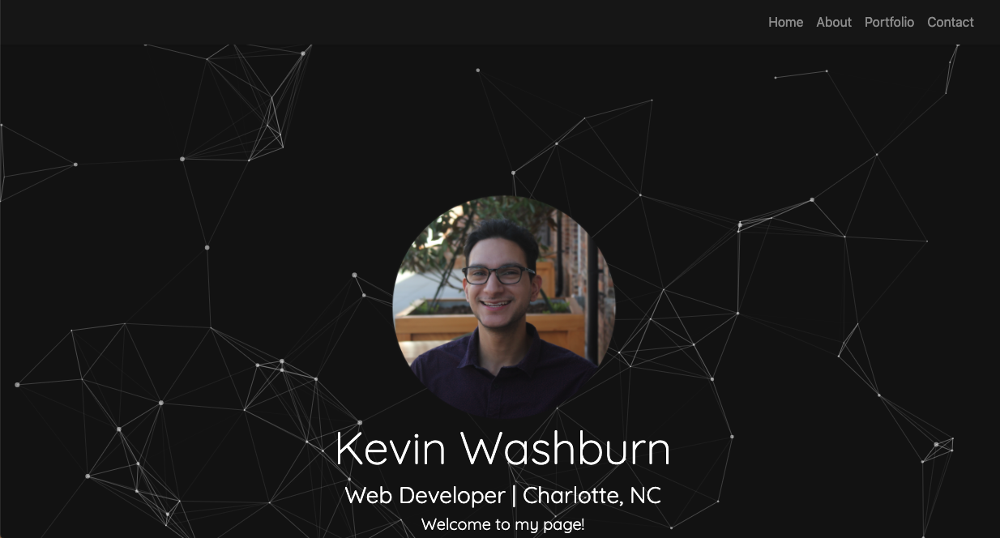

# Responsiveness-Portfolio

This portfolio site is comprised of three pages. "About Me" gives a brief background on why I want to pursue web development and shows a photograph of myself. "Portfolio" displays the different webpages and web applications that I have worked on throughout the bootcamp. Finally, "Contact" shows a form that will allow the user to contact me directly via email. 

In addition to the content summarized above, the site's layout is responsive based on the screen size of the user's device.

Link to Deployed Site:
https://kevincwashburn.github.io/Responsiveness-Portfolio/

Screenshot:

